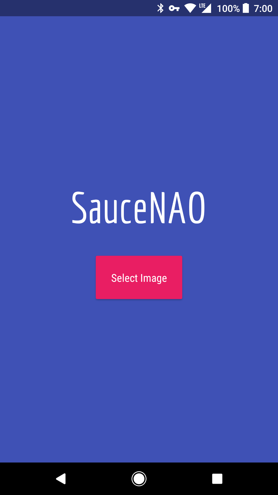
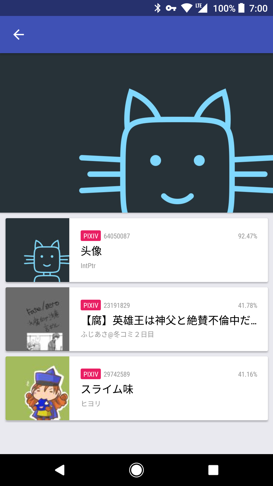

# SauceNAO

Unofficial Android client for SauceNAO.

 

## Development

``` shell
$ npm install
$ npm start
```

### Rebuild Assets

Prerequisites:
- Inkscape

``` shell
$ npm run build-assets
```
